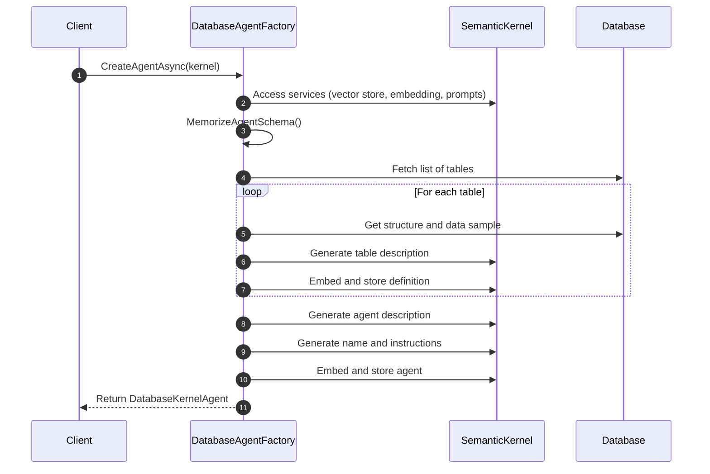
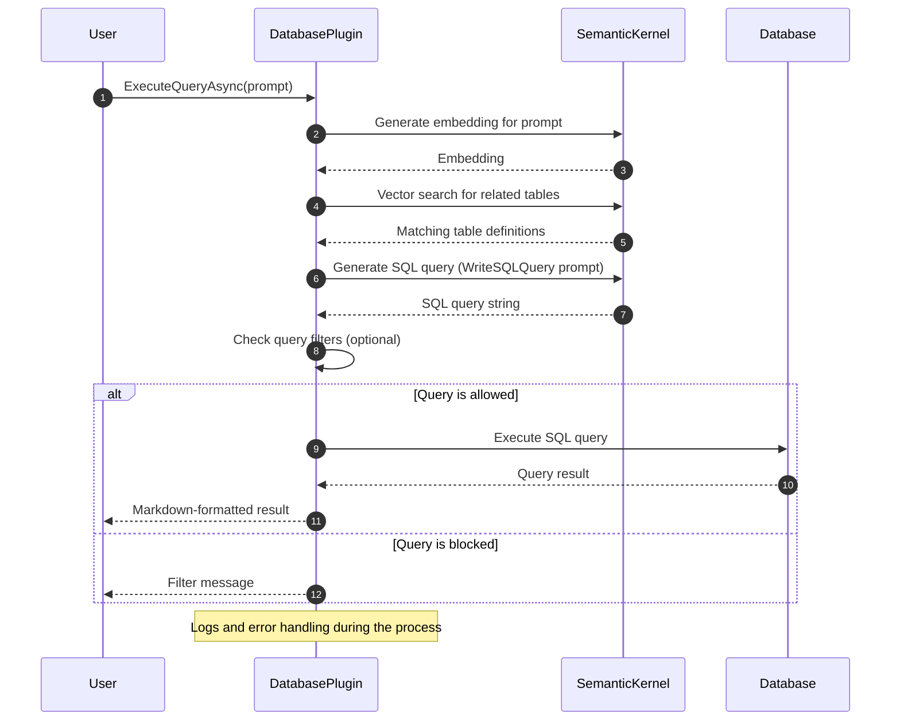

# Database Agent for Semantic Kernel

[](https://github.com/kbeaugrand/SemanticKernel.Agents.DatabaseAgent/actions/workflows/build_test.yml)
[](https://github.com/kbeaugrand/SemanticKernel.Agents.DatabaseAgent/actions/workflows/publish.yml)
[](https://img.shields.io/github/v/release/kbeaugrand/SemanticKernel.Agents.DatabaseAgent)
[](https://img.shields.io/github/v/release/kbeaugrand/SemanticKernel.Agents.DatabaseAgent)

## Overview

The Database Agent for Semantic Kernel is a service that provides a database management system (DBMS) for the Semantic Kernel (NL2SQL). The Agent is responsible for managing the storage and retrieval of data from the Semantic Kernel. 
This built on top of the [Microsoft's Semantic Kernel](https://github.com/microsoft/semantic-kernel) and Semantic Kernel Memory connectors to memorize database schema and relationships to provide a more efficient and accurate database management system.


## Models Tested

| Model Name          | NL 2 SQL  | Quality Insurance | Score  | Speed (avg time/op.)   |
|---------------------|:---------:|:----------------:|:-------:|:----------------------:|
| gpt-4o-mini         | ✅        | ✅               |   90%  |     Fast (~3sec)       |
| phi4:14b            | ✅        | ✅               |   90%  |     Slow (~10sec)      |
| llama4:scout        | ✅        | ✅               |   90%  |     Slow (~10sec)      |
| gpt-4.1-mini        | ✅        | ✅               |   80%  |     Fast (~3sec)       |
| devstral:24b        | ✅        | ✅               |   80%  |     Slow (~10sec)      |
| qwen2.5-coder:7b    | ⚠️ (WIP)  | ⚠️ (WIP)         |   50%  |     Fast (~3sec)       |
| qwen3:8b            | ⚠️ (WIP)  | ⚠️ (WIP)         |   50%  |     Slow (~10sec)      |

> Note: current score is a personal evaluation regarding the test cases with Northwind database and a set of queries.
>       development is firstly focused on the gpt-4o-mini model, which is the most performant and accurate model for NL2SQL tasks.
>       for the evaluation, the TopP and Temperature parameters are set to 0.1, which is the recommended setting.

**DICLAIMER**

Even if the model is marked as tested, it does not mean that it will work for all queries. 
Furthermore, **using LLM agents might lead to risks such as unintended data exposure, security vulnerabilities, and inefficient query execution, potentially compromising system integrity and compliance requirements.**

## Getting Started

### Prerequisites

- [.NET 8.0 SDK](https://dotnet.microsoft.com/download/dotnet/8.0)

### Installation

To use the Database Agent for Semantic Kernel, you must first install the package from NuGet.

```bash
dotnet add package SemanticKernel.Agents.DatabaseAgent
```

### Usage

To use the Database Agent for Semantic Kernel, you must first create an instance of the `DatabaseAgent` class and provide the necessary configuration settings.

```csharp
using Microsoft.KernelMemory;
using Microsoft.SemanticKernel;
using Microsoft.SemanticKernel.ChatCompletion;
using SemanticKernel.Agents.DatabaseAgent;

var kernelBuilder = Kernel.CreateBuilder()
                ...
                .Build();

kernelBuilder.Services.AddSingleton<DbConnection>((sp) =>
            {
                // Configure the database connection
                return new SqliteConnection(configuration.GetConnectionString("DefaultConnection"));
            });

var kernel = kernelBuilder.Build();

var agent = await DBMSAgentFactory.CreateAgentAsync(kernel);

// execute the NL2SQL query
var responses = agent.InvokeAsync([new ChatMessageContent { Content = question, Role = AuthorRole.User }], thread: null)
                                            .ConfigureAwait(false);
```

## Install the MCP Server as a Docker Image

The database agent MCP server can be run as a Docker image. This allows you to run the server in a containerized environment, making it easy to deploy and manage to expose it SSE (Server-Sent Events) and HTTP endpoints. 

To run the MCP server as a Docker image, you can use the following command:

```bash

docker run -it --rm \
  -p 8080:5000 \
  -e DATABASE_PROVIDER=sqlite \
  -e DATABASE_CONNECTION_STRING="Data Source=northwind.db;Mode=ReadWrite" \
  -e MEMORY_KIND=Volatile \
  -e KERNEL_COMPLETION=gpt4omini \
  -e KERNEL_EMBEDDING=textembeddingada002 \
  -e SERVICES_GPT4OMINI_TYPE=AzureOpenAI \
  -e SERVICES_GPT4OMINI_ENDPOINT=https://xxx.openai.azure.com/ \
  -e SERVICES_GPT4OMINI_AUTH=APIKey \
  -e SERVICES_GPT4OMINI_API_KEY=xxx \
  -e SERVICES_GPT4OMINI_DEPLOYMENT=gpt-4o-mini \
  -e SERVICES_TEXTEMBEDDINGADA002_TYPE=AzureOpenAI \
  -e SERVICES_TEXTEMBEDDINGADA002_ENDPOINT=https://xxx.openai.azure.com/ \
  -e SERVICES_TEXTEMBEDDINGADA002_AUTH=APIKey \
  -e SERVICES_TEXTEMBEDDINGADA002_API_KEY=xxx \
  -e SERVICES_TEXTEMBEDDINGADA002_DEPLOYMENT=text-embedding-ada-002 \
  ghcr.io/kbeaugrand/database-mcp-server
```

### Behind the scenes

Here is a simplified sequence diagram of how the Database Agent is constructed using the Semantic Kernel before it can be used:



Then, once the agent is created, the client can use it to execute queries.



## Quality insurance

Using LLM agents to write and execute its own queries into a database might lead to risks such as unintended data exposure, security vulnerabilities, and inefficient query execution, potentially compromising system integrity and compliance requirements.
To mitigate these risks, the Database Agent for Semantic Kernel provides a set of quality assurance features to ensure the safety and reliability of the queries executed by the agent.

### Additional Configuration

First, you must add the ``QualityAssurance`` package for DatabaseAgent to your project.

```bash
dotnet add package SemanticKernel.Agents.DatabaseAgent.QualityAssurance
```

Next, you must configure the quality insurance settings for the Database Agent.
```csharp
    kernelBuilder.Services.UseDatabaseAgentQualityAssurance(opts =>
                            {
                                opts.EnableQueryRelevancyFilter = true;
                                opts.QueryRelevancyThreshold = .8f;
                            });
```

### Quality Assurance Features

The Database Agent for Semantic Kernel provides the following quality assurance features:
`QueryRelevancyFilter`: Ensures that only relevant queries are executed by the agent. The filter uses LLM to generate the description of the query that is intended to be executed, then compute the cosine similarity between the user prompt and the generated description. If the similarity score is below the threshold, the query is rejected.

### Create a custom quality assurance filter

You can create a custom quality assurance filter by implementing the `IQueryExecutionFilter` interface and registering it with the DI container.
```csharp
kernelBuilder.Services.AddTransient<IQueryExecutionFilter, CustomQueryExecutionFilter>();

public class CustomQueryExecutionFilter : IQueryExecutionFilter
{
    public async Task OnQueryExecutionAsync(QueryExecutionContext context, Func<QueryExecutionContext, Task> next)
    {
        // Implement custom query execution logic
        return Task.FromResult(true);
    }
}
```

## Contributing

We welcome contributions to enhance this project. Please fork the repository and submit a pull request with your proposed changes.

## License

This project is licensed under the MIT License. See the [LICENSE](LICENSE.md) file for details.

## Acknowledgments

- [Microsoft's Kernel Memory](https://github.com/microsoft/kernel-memory) for providing the foundational AI service.
- The open-source community for continuous support and contributions.
